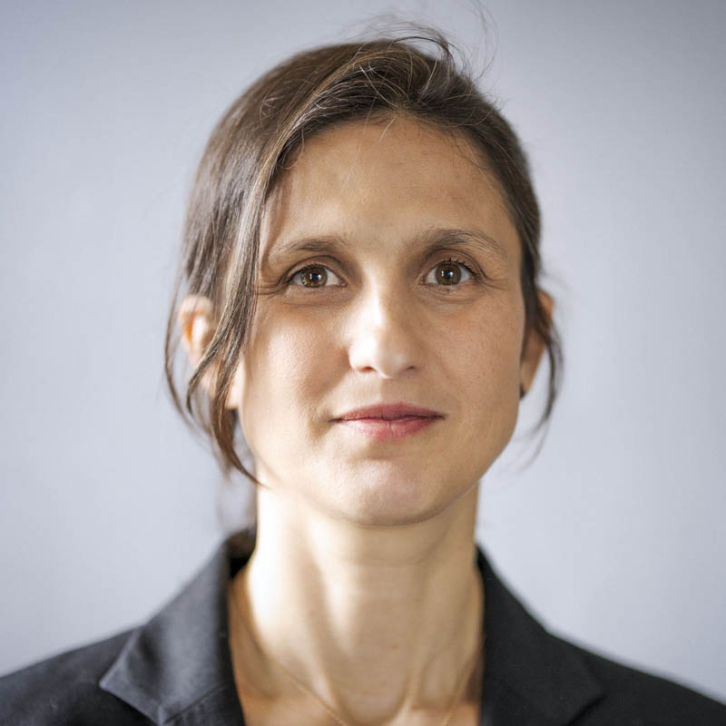

# About this website 

This website was created with the aim of spreading awareness about the concept of the **Dynamic Consistency Boundary** (DCB).

Our goals are threefold:

1. **Explain the rationale** behind the DCB approach
2. **Provide a practical guide** for those who want to start applying it
3. **Collect and organize** as many resources as possible on this topic

This is a **non-commercial project**. We have no financial interest or sponsorship: our motivation is purely educational and driven by a desire to contribute to the tech community.

We believe DCB can be a significant step forward in the design and management of complex systems, and we want to help make it accessible to anyone interested.

---

## Who We Are

{data-title="Bastian Waidelich" data-description="Self-employed Software Architect, Consultant"}
/// caption
**Bastian Waidelich**

Self-employed Software Architect, Consultant

[:fontawesome-brands-github:](https://github.com/bwaidelich){:target="_blank"} | 
[:fontawesome-brands-linkedin:](https://www.linkedin.com/in/bastian-waidelich-84865221){:target="_blank"} | [:fontawesome-brands-twitter:](https://x.com/bwaidelich){:target="_blank"}
///

{data-title="Sara Pellegrini" data-description="Software Engineer, Continuous Learner, Free Thinker"}
/// caption
***Sara Pellegrini***

Software Engineer, Continuous Learner, Free Thinker

[:fontawesome-brands-github:](https://github.com/saratry){:target="_blank"} | 
[:fontawesome-brands-linkedin:](https://www.linkedin.com/in/sara-pellegrini-55a37913){:target="_blank"} | [:fontawesome-brands-twitter:](https://x.com/_sara_p_){:target="_blank"}
///

{data-title="Paul Grimshaw" data-description="Head of Software Engineering for Asset Management at Kraken"}
/// caption
***Paul Grimshaw***

Head of Software Engineering for Asset Management at Kraken

[:fontawesome-brands-github:](https://github.com/PaulGrimshaw){:target="_blank"} | 
[:fontawesome-brands-linkedin:](https://www.linkedin.com/in/pkgrimshaw){:target="_blank"} |
[:fontawesome-brands-twitter:](https://x.com/Pkgrimshaw){:target="_blank"}
///

---

## Contact Us

For collaborations, suggestions, or just to connect, feel free to reach out to us via email [:material-email:](mailto:hello%40dcb.events){.small} or through our social profiles.

Also, feel free to join the discussions at the footer of each page or via the Github Repository of this website [:octicons-link-external-16:](https://github.com/dcb-events/dcb-events.github.io/discussions){:target="_blank" .small}