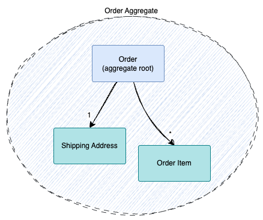
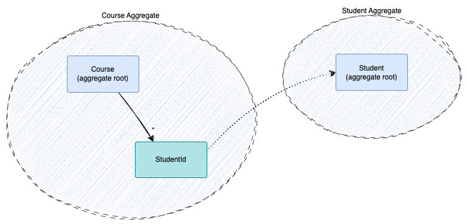

The idea of DCB started with the goal of [killing the Aggregate](https://sara.event-thinking.io/2023/04/kill-aggregate-chapter-1-I-am-here-to-kill-the-aggregate.html){:target="_blank"}.

This article aims to explain our interpretation of the Aggregate pattern and why we consider it problematic.

## What is an Aggregate?

An Aggregate, as described in [Domain-Driven Design](../glossary.md#domain-driven-design) refers to:

> "[...] a cluster of associated objects that we treat as a unit for the purpose of data changes"    
> _– [Eric Evans, 2003](https://www.informit.com/store/domain-driven-design-tackling-complexity-in-the-heart-9780132181273){:target="_blank"}_{: .author}

Its primary role is to enforce consistency.

### Consistency

Consistency generally refers to the **stability**, **coherence**, and **predictability** of a system's state. Within the context of an Aggregate, it specifically concerns the enforcement of business invariants under concurrent access conditions.

For example, let's assume that we want to ensure that a course must never be overbooked (sticking to the common theme of this website).

A simple implementation in a classical, state-based architecture could look something like this (pseudo code):

```haskell linenums="1"
course = db.loadCourse('c1');
if (course.numberOfSubscribers >= course.capacity) {
    // fail
}
course.numberOfSubscribers ++;
db.update(course);
```

This code is not thread-safe: between the execution of lines 2 and 6, a different process might already update the same course and violate the constraints as a result.

To prevent these potential race conditions, there are two common approaches:

#### Pessimistic Locking

With Pessimistic Locking, a resource is locked as soon as it's accessed, preventing others from modifying it until the lock is released.

With the current example, this could be achieved with a lock on the corresponding database table:

```haskell linenums="1" hl_lines="1 8"
db.lockCourseTable();
course = db.loadCourse('c1');
if (course.numberOfSubscribers >= course.capacity) {
    // fail
}
course.numberOfSubscribers ++;
db.update(course);
db.releaseCourseTableLock();
```

While this might seem tempting, it is not without problems because it might lead to deadlocks if two processes wait for each other, or if a lock isn't properly released.
But, more importantly, It prevents **any other course from being updated while the lock is active**.

Even if only the affected course were locked, it would prevent independent parallel changes (e.g. changing concurrently the course title and the course description).

#### Optimistic Locking

With Optimistic Locking, multiple users can read and modify the same data, but updates are only allowed if the data hasn't changed since it was read.

This is usually achieved with a _version number_

```haskell linenums="1" hl_lines="6"
course = db.loadCourse('c1');
if (course.numberOfSubscribers >= course.capacity) {
    // fail
}
course.numberOfSubscribers ++;
db.update(course, course.version);
```

The `update` call fails if the `version` was updated in the meantime.

## The Aggregate Pattern

The Aggregate Pattern formalizes consistency boundaries by **modeling them explicitly within the Domain Model**, rather than relying on infrastructural low-level locking mechanisms.

In this pattern, closely related domain entities and value objects are grouped into an Aggregate, with one entity designated as the Aggregate Root. The Aggregate Root serves as the exclusive access point, mediating all state changes. This ensures that all invariants and business rules are enforced consistently and atomically within the boundary of the Aggregate.

A typical example is an `Order` Aggregate, where operations such as adding or removing line items are only performed through methods on the `Order` Aggregate Root. This guarantees that domain invariants—such as the correctness of the total price—are maintained at all times:


/// caption
///

Applied to the course example, we could model a `Course` as the Aggregate Root:


/// caption
///

However, embedding the `Student` entity within the `Course Aggregate` would be inappropriate, as it would imply that all modifications to a `Student` must be performed through the `Course Aggregate Root`. A more suitable approach is to model `Student` as a separate Aggregate, which aligns with the principle that Aggregates should encapsulate only tightly coupled data and behavior.

This separation is feasible because it's perfectly valid for one Aggregate to reference another by its identifier:


/// caption
///

### Limitations

This pattern enforces, by design, that state changes are confined to a single Aggregate instance per transactional boundary.
Or, as Eric Evans puts it:


> "Any rule that spans Aggregates will not be expected to be always up to date. Through event processing, batch processing, or other update mechanisms, other dependencies can be resolved within some specified time. But the invariants applied within an Aggregate will be enforced with the completion of each transaction"    
> _– [Eric Evans, 2003](https://www.informit.com/store/domain-driven-design-tackling-complexity-in-the-heart-9780132181273){:target="_blank"}_{: .author}


This restriction is acceptable as long as an operation impacts only the invariants encapsulated within a single Aggregate. However, there are scenarios where this assumption breaks down. Consider extending the previous example with an additional business rule:

- A student must not be enrolled in more than 10 courses

With that, subscribing a student affects the invariants of two Aggregates.

!!! note
    In some cases, such challenges indicate poorly defined Aggregate boundaries. However, in this scenario, restructuring the model — for example, by introducing a `Subscription` Aggregate — would not resolve the issue, since the business invariants related to both `Course` and `Student` must still be enforced independently within their respective Aggregates.

In a traditional persistence model, one possible workaround would be to lock both affected records in the database to ensure consistency. However, this approach directly violates the pattern by introducing tight coupling between Aggregates, and it brings with it a host of other issues, such as performance bottlenecks and deadlocks. In an event-driven architecture, this solution is entirely infeasible, as it contradicts the principles of eventual consistency and decoupled processing.

Instead, the typical solution in such cases is to decompose the process into a series of coordinated steps. This means renouncing the strong consistency of all the invariants and accepting partial updates that will be eventually reverted by corrective events if needed. While this approach can work, it introduces significant complexity and can lead to invalid intermediate states until the compensating action is executed. Moreover, in event-driven architectures, this strategy leads to the generation of additional events that, although necessary from a technical perspective, don't correspond to meaningful business interactions.
