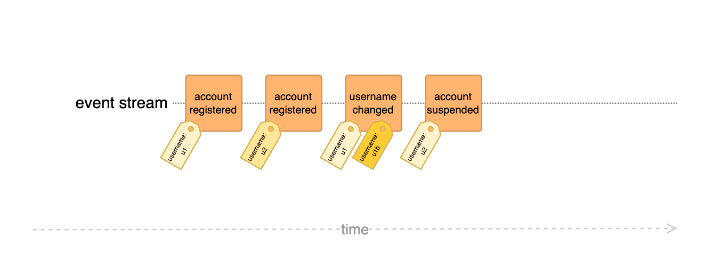

# Unique username example

Enforcing globally unique values is simple with strong consistency (thanks to tools like unique constraint indexes), but it becomes significantly more challenging with <dfn title="Consistency model that prioritizes availability and partition tolerance over immediate consistency">eventual consistency</dfn>.

## Challenge

The goal is an application that allows users to subscribe with a username that uniquely identifies them.

As a bonus, this example is extended by adding the following features:

- Allow usernames to be re-claimed when the account was suspended
- Allow users to change their username
- Only release unused usernames after a configurable delay

## Traditional approaches

There are a couple of common strategies to achieve global uniqueness in event-driven systems:

- **Eventual consistency**: Use a <dfn title="Representation of data tailored for specific read operations, often denormalized for performance">Read Model</dfn> to check for uniqueness and handle a duplication due to race conditions after the fact (e.g. by deactivating the account or changing the username)

     > :material-forward: This is of course a potential solution, with or without DCB, but it falls outside the scope of these examples

- **Dedicated storage**: Create a dedicated storage for allocated usernames and make the write side insert a record when the corresponding Event is recorded
    
      > :material-forward: This adds a source of error and potentially locked usernames unless Event and storage update can be done in a single transaction

- **Reservation Pattern:** Use the <dfn title="Design pattern used to temporarily hold or reserve a resource or state until the process is completed">Reservation Pattern</dfn> to lock a username and only continue if the locking succeeded

      > :material-forward: This works but adds quite a lot of complexity and additional Events and the need for <dfn title="Coordinates a sequence of local transactions across multiple services, ensuring data consistency through compensating actions in case of failure">Sagas</dfn> or multiple writes in a single request

## DCB approach

With DCB all Events that affect the unique constraint (the username in this example) can be tagged with the corresponding value (or a hash of it):

### Feature 1: Globally unique username

This example is the most simple one just checking whether a given username is claimed

### Feature 2: Release usernames

This example extends the previous one to show how a previously claimed username could be released when the corresponding account is suspended

### Feature 3: Allow changing of usernames

This example extends the previous one to show how the username of an active account could be changed

### Feature 4: Username retention

In the previous examples a username that is no longer claimed, can be used _immediately_ again for new accounts.
This example extends the previous one to show how the a username can be reserved for a configurable amount of time before it is released.

!!! note

    The `daysAgo` property of the Event metadata is a simplification. Typically, a timestamp representing the Event's recording time is stored within the Event's payload or metadata. This timestamp can be compared to the current date to determine the Event's age in the decision model.

## Conclusion

This example demonstrates how to solve one of the Event Sourcing evergreens: Enforcing unique usernames. But it can be applied to any scenario that requires global uniqueness of some sort.