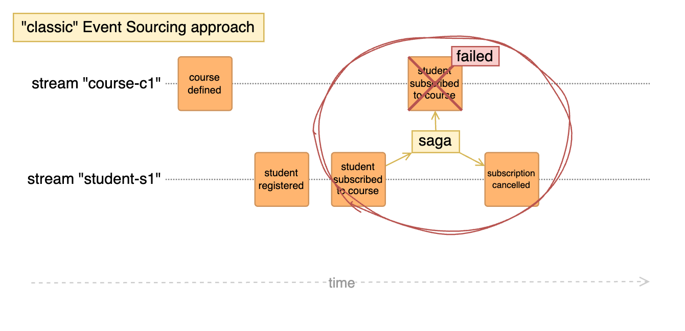

# What is it?

Dynamic Consistency Boundary (DCB) is a technique for enforcing consistency in event-driven systems without relying on rigid transactional boundaries.

Traditional systems use strict constraints to maintain immediate consistency, while event-driven architectures embrace eventual consistency for scalability and resilience. However, this flexibility raises challenges in defining where and how consistency should be enforced.

Introduced by Sara Pellegrini in her blog post "[Killing the Aggregate](https://sara.event-thinking.io/2023/04/kill-aggregate-chapter-1-I-am-here-to-kill-the-aggregate.html){:target="_blank"}", DCB provides a pragmatic approach to balancing strong consistency with flexibility. Unlike eventual consistency, which allows temporary inconsistencies across system components, DCB selectively enforces strong consistency where needed, particularly for operations spanning multiple entities. This ensures critical business processes and cross-entity invariants remain reliable while avoiding the constraints of traditional transactional models. DCB helps teams optimize performance, scalability, and operational correctness by defining context-sensitive consistency boundaries.

## How it works

To illustrate how DCB works, it makes sense first to explain the traditional Event Sourcing approach and its main issue:

In her blog post, Sara describes an example application that allows students to subscribe to courses.
In this example, we assume the constraints applied to the student and the course to ensure their integrity are invariants. In other words, those constraints must always be satisfied before transitioning to a new state. For this reason, the student and the course are typically implemented as [Aggregates](glossary.md#aggregate).

But then, constraints that affect both entities are introduced, namely:

- a course cannot accept more than n students
- a student cannot subscribe to more than 10 courses

### Traditional approach

In many contexts, it is impossible to update two aggregates with a single transaction; for this reason, such requirements are usually solved with a Saga or [Process Manager](glossary.md#process-manager) that coordinates the process:

1. Mark the student to be subscribed by publishing an Event to the Event Stream of the student
2. Potentially in parallel, mark the course by publishing an Event to the Event Stream of the affected course
3. If one of the two previous operations fails due to constraint violations (e.g. because another student was subscribed to the same course in the meantime), append some compensating Event 



This approach poses some issues in terms of added complexity and unwanted side effects (e.g. the state of the system being incorrect for a short period of time).

But even for the happy path, the implementation leads to **two Events** being published that represent **the same fact**.

### DCB approach

DCB solves this issue by allowing Events to be tagged when they are published.
This allows one Event to affect **multiple** entities/concepts in the same bounded context.

As a result, there is only a single Event Stream per bounded context, and the example above can be simplified to:


#### Reading Events

A DCB compliant Event Store allows to filter Events by their Type and/or Tags.

To determine how many students are enrolled in a course, simply count the subscription Events tagged with that course's identifier.
Similarly, to find out how many courses a student is subscribed to, count the subscription Events tagged with that student's identifier.

Those queries can be combined. To find out...

- ...whether the course with a specified id (e.g. `c1`) exists
- ...whether the _student_ with the specified id (e.g. `s1`) exists
- ...how many students are subscribed to a course
- ...and how many courses the student is subscribed to

the following query items can be specified (pseudo code):

```json
[
  {
    "event_type": "course defined",
    "tag": "course:c1"
  },
  {
    "event_type": "student registered",
    "tag": "student:s1"
  },
  {
    "event_type": "student subscribed to course",
    "tag": "course:c1"
  },
  {
    "event_type": "student subscribed to course",
    "tag": "student:s1"
  }
]
```

As a result, only the Events matching the specified query will be returned:

- one for the `course defined` Event (if the course exists)
- one for the `student registered` Event (if the student was registered)
- one for each subscription to the course
- one for each subscription of the student

!!! info

    Usually those queries wouldn't be "hard coded". Instead, they can be derived from an in-memory projection (aka "decision model") as demonstrated by some of the [Examples](examples/index.md)

#### Writing Events

Similar to a traditional Event Store, DCB can enforce consistency when persisting Events using [Optimistic Locking](glossary.md#optimistic-locking).

However, unlike the traditional approach, DCB does not rely on streams or revisions. Instead, it passes the *same query* used to read Events for building the in-memory decision model along with the position of the last Event consumed by the client. The DCB Event Store then ensures that no new Events matching the same query were added in the meantime.

This can be compared to the "expected revision" mechanism of traditional Event Stores but does not require the Event Streams to be split-up in order to allow for parallel, unrelated, writes.

## Getting started

Visit the [Examples](examples/index.md) section to explore various use cases for DCB.

The [related topics](topics/index.md) section provides in-depth articles on additional subjects related to DCB.

To begin using DCB, refer to the [libraries](resources/libraries.md) section.
