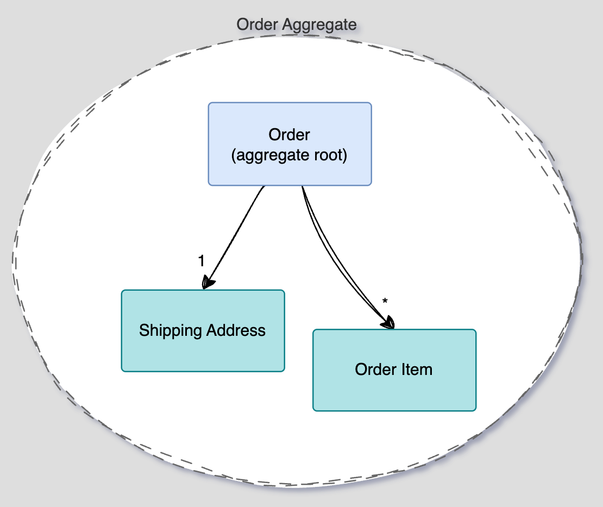
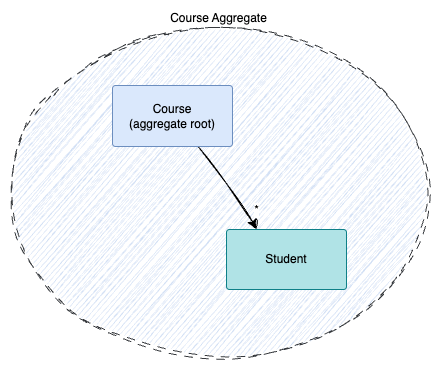
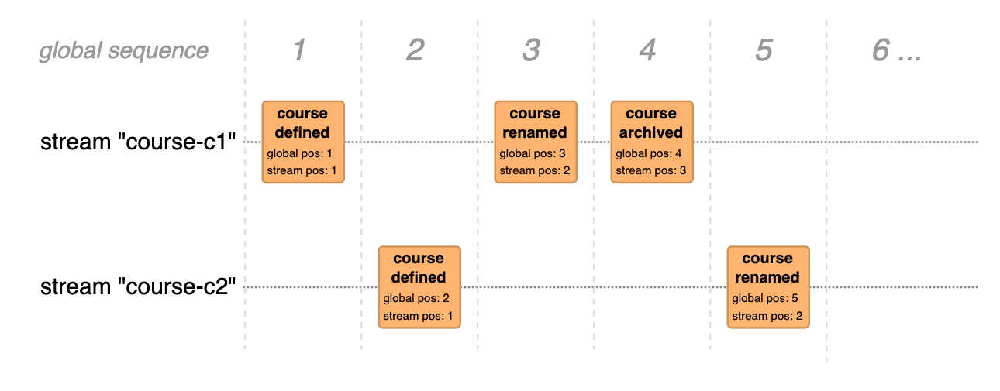

The idea of DCB started with the goal of killing the Aggregate [:octicons-link-external-16:](https://sara.event-thinking.io/2023/04/kill-aggregate-chapter-1-I-am-here-to-kill-the-aggregate.html){:target="_blank" .small}.

This article aims to explain our interpretation of the Aggregate pattern and why we consider it problematic.

## What is an Aggregate?

An Aggregate, as described in <dfn title="Domain-Driven Design: Software design approach that focuses on modeling a system based on the core domain, using the language and concepts of domain experts">DDD</dfn> refers to:

> "[...] a cluster of associated objects that we treat as a unit for the purpose of data changes"    
> _– Eric Evans, 2003 [:octicons-link-external-16:](https://www.informit.com/store/domain-driven-design-tackling-complexity-in-the-heart-9780132181273){:target="_blank" .small}_{: .author}

Its primary role is to enforce consistency.

### Consistency

While consistency broadly refers to the **stability**, **coherence**, and **predictability** of a system's state, the Aggregate Pattern focuses on a more specific meaning: creating a Decision Model used to ensure that business invariants are consistently enforced, even when multiple operations or users interact with the system concurrently.

For example, let's assume that we want to ensure that a course must never be overbooked (sticking to the common theme of this website).

A simple implementation in a classical, state-based architecture could look something like this (pseudo code):

```haskell linenums="1"
course = db.loadCourse('c1')
if (course.numberOfSubscribers >= course.capacity) {
    // fail
}
course.numberOfSubscribers ++
db.update(course)
```

This code is not thread-safe: between the execution of lines 2 and 6, a different process might already update the same course and violate the constraints as a result.

To prevent these potential race conditions, there are two common approaches:

#### Pessimistic Locking

With Pessimistic Locking, a resource is locked as soon as it's accessed, preventing others from modifying it until the lock is released.

With the current example, this could be achieved with a lock on the corresponding database table:

```haskell linenums="1" hl_lines="1 8"
db.lockCourseTable()
course = db.loadCourse('c1')
if (course.numberOfSubscribers >= course.capacity) {
    // fail
}
course.numberOfSubscribers ++
db.update(course)
db.releaseCourseTableLock()
```

While this might seem tempting, it is not without problems because it might lead to deadlocks (which can happen as soon there are _multiple_ locks and no consistent acquiring order).
But, more importantly, It prevents **any other course from being updated while the lock is active**.

Even if only the affected course were locked, it would prevent independent parallel changes (e.g. changing concurrently the course title and the course description).

#### Optimistic Locking

With Optimistic Locking, multiple users can freely read and attempt to modify the same data. However, updates are only permitted if the data remains unchanged since it was read. This allows unrestricted reading, while writing faces similar constraints to pessimistic locking — but typically requires shorter database locks.

It is usually achieved with a _version number_

```haskell linenums="1" hl_lines="6"
course = db.loadCourse('c1')
if (course.numberOfSubscribers >= course.capacity) {
    // fail
}
course.numberOfSubscribers ++
db.update(course, course.version)
```

The `update` call fails if the `version` was updated in the meantime.

## The Aggregate Pattern

The Aggregate Pattern formalizes consistency boundaries by **modeling them explicitly within the Domain Model**, rather than relying on infrastructural low-level locking mechanisms.

In this pattern, closely related domain entities and value objects are grouped into an Aggregate, with one entity designated as the Aggregate Root. The Aggregate Root serves as the exclusive access point, mediating all state changes. This ensures that all invariants and business rules are enforced consistently and atomically within the boundary of the Aggregate.

A typical example is an `Order` Aggregate, where operations such as adding or removing line items are only performed through methods on the `Order` Aggregate Root. This guarantees that domain invariants—such as the correctness of the total price—are maintained at all times:

{data-description="The Order is the Aggregate root. Shipping Address and Order Items are also part of the Order Aggregate" data-gallery="aggregate-pattern"}
/// caption
The `Order` is the Aggregate root. `Shipping Address` and `Order Items` are also part of the `Order` Aggregate
///

Applied to the course example, we could model a `Course` as the Aggregate Root:

{data-description="An Aggregate with the Course acting as Aggregate root with relations to Student entities" data-gallery="aggregate-pattern"}
/// caption
An Aggregate with the `Course` acting as Aggregate root with relations to `Student` entities
///

However, embedding the `Student` entity within the `Course Aggregate` would be inappropriate, as it would imply that all modifications to a `Student` must be performed through the `Course Aggregate Root`. A more suitable approach is to model `Student` as a separate Aggregate, which aligns with the principle that Aggregates should encapsulate only tightly coupled data and behavior.

This separation is feasible because it's perfectly valid for one Aggregate to reference another by its identifier:

{data-description="Extracting the Student entity to a separate Aggregate, referenced by the Aggregate root identifier (StudentId)" data-gallery="aggregate-pattern"}
/// caption
Extracting the `Student` entity to a separate Aggregate, referenced by the Aggregate root identifier (`StudentId`)
///

### Limitations

This pattern enforces, by design, that state changes are confined to a single Aggregate instance per transactional boundary.
Or, as Eric Evans puts it:


> "Any rule that spans Aggregates will not be expected to be always up to date. Through event processing, batch processing, or other update mechanisms, other dependencies can be resolved within some specified time. But the invariants applied within an Aggregate will be enforced with the completion of each transaction"    
> _– Eric Evans, 2003 [:octicons-link-external-16:](https://www.informit.com/store/domain-driven-design-tackling-complexity-in-the-heart-9780132181273){:target="_blank" .small}_{: .author}


This restriction is acceptable as long as an operation impacts only the invariants encapsulated within a single Aggregate. However, there are scenarios where this assumption breaks down. Consider extending the previous example with an additional business rule:

- A student must not be enrolled in more than 10 courses

With that, subscribing a student affects the invariants of two Aggregates.

!!! note
    In some cases, such challenges indicate poorly defined Aggregate boundaries. However, in this scenario, restructuring the model — for example, by introducing a `Subscription` Aggregate — would not resolve the issue, since the business invariants related to both `Course` and `Student` must still be enforced independently within their respective Aggregates.

    Likewise, making the Aggregate larger, covering more entities and value objects, is not a real option in this situation. Indeed, it would mean creating a single aggregate that includes all courses and all students, to cover any possible subscription. However, this has the obvious drawback of reducing scalability, cohesion, and the degree of parallel processing.

In a traditional persistence model, one possible workaround would be to lock both affected records in the database to ensure consistency. However, this approach directly violates the pattern and introduces a host of other issues:

> "Relational databases allow various locking schemes, and special tests can be programmed. But these ad-hoc solutions
quickly divert attention away from the model, and soon you are back to hacking and hoping."
> _– Eric Evans, 2003 [:octicons-link-external-16:](https://www.informit.com/store/domain-driven-design-tackling-complexity-in-the-heart-9780132181273){:target="_blank" .small}_{: .author}

Instead, the typical solution in such cases is to decompose the process into a series of coordinated steps. This means dropping the strong consistency of all the invariants and accepting partial updates that will be eventually reverted by corrective Events if needed. While this approach can work, it introduces significant complexity and can lead to invalid intermediate states until the compensating action is executed. Moreover, in event-driven architectures, this strategy leads to the generation of additional Events that, although necessary from a technical perspective, don't correspond to meaningful business interactions.

## Event-Sourced Aggregate

With Event Sourcing, strong consistency is usually enforced using optimistic concurrency:

- Relevant Events are loaded, remembering the position of the last consumed Event
- A decision is made based on the projected state of those Events
- If successful, a new Event is appended specifying the remembered position
- The Event Store appends the new Event only if no other Event was stored in the meantime and fails otherwise
- Upon failure the process can be repeated until the Event was successfully persisted

### Event Streams

With only one global Event Stream, all actions would be forced through a single sequence, ruling out parallel execution entirely. That can be compared to a single Aggregate that covers all entities of the application.

To work around this, the Events are partitioned into sub Event Streams, which each Event being assigned to a single Stream and the position (aka "sequence number", "version" or "revision") the Event has in that Stream – in addition to the global position:

{ data-description="Each Event is assigned to a single Stream and contains the position in that Stream as well as the position in the global Stream" data-gallery="event-streams"}
/// caption
Each Event is assigned to a single Stream and contains the position in that Stream as well as the global position
///

The Event Store appends new Events only if the last Event *in the same Event Stream* is equal to the specified position and fails otherwise. This way it can guarantee transaction safety for one Event Stream at a time.

This makes the Event Stream a good match for [Aggregates](../topics/aggregates.md), as demonstrated in the previous illustration: Course-Events are persisted to Streams of the corresponding Aggregate instance "`course-<courseIdentifier>`"

### Consequences

While Event-Sourced Aggregates bring powerful capabilities, it's important to recognize that they are subject to the same limitations as traditional Aggregates. In fact, their boundaries tend to be even more rigid, as they become materialized in the structure of the Event Streams. This rigidity can make it significantly harder to adapt the design later on, especially as the model evolves and new insights emerge.

We believe that flexibility is essential in software design — it should leave room for mistakes, experimentation, and new realizations as understanding deepens over time. Additionally, Event-Sourced Aggregates often grow in size as more Events accumulate, which can negatively impact performance. Although there are mitigation strategies, such as snapshots or patterns like "closing the books", they often come at the cost of added complexity.

## Relation to DCB

Dynamic Consistency Boundaries offer an alternative approach by allowing consistency to be enforced for a specific use case, rather than being hardwired into a static Aggregate structure. This is where the "dynamic" aspect comes in — not because the consistency is weaker or less accurate, but because the boundary is established at runtime, tailored to the requirements of a single interaction.

As a result, only the Events that are necessary to evaluate those invariants are loaded and considered, improving flexibility and potentially reducing overhead.

In essence, DCB makes it possible to construct a Decision Model dynamically, just for the duration of an operation, to guard the relevant invariants.

### Killing it, really?

While the phrase "Killing the Aggregate" might sound provocative, we don’t view DCB as a rejection of the Aggregate pattern. On the contrary, we see it as an *evolution* — one that preserves the core intent of Aggregates, especially when viewed from the perspective of a single interaction.

That said, we've chosen not to overload the term “Aggregate” any further, especially given the existing ambiguity and varied interpretations in the community. Instead, we often refer to this construct as a **Decision Model**, emphasizing its role in evaluating business rules and producing decisions in a specific context.

<p>&nbsp;</p>
<center><em>The Aggregate is dead, long live the Aggregate</em></center>

## Conclusion

- It is important to think about consistency boundaries and hard vs soft constraints when building software
- The Aggregate pattern allows to make this part of the Domain Model
- It is, however, very rigid – especially with the Event Sourced Aggregate
- DCB allows to enforce explicit boundaries for a specific use case
- Thus it is much more flexible because to build the Decision Model by [composing Projections](projections.md)
- DCB can be used without breaking the Aggregate pattern, and still gain advantages
