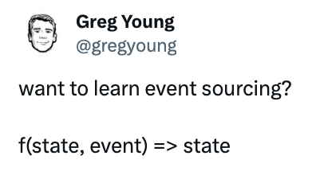

A Projection is deriving a specific state by replaying a sequence of relevant Events.

In other words, it's reading and transforming Events into a model built for a specific need.

The result is commonly used for persistent [Read Models](../glossary.md#read-model).

In Event Sourcing, however, projections are also used to build the [Decision Model](../glossary.md#decision-model) needed to enforce consistency constraints. 

This website typically refers to this latter kind of projection since DCB primarily focuses on ensuring the consistency of the Event Store during write operations.

This article explains, how projections can be written such that a DCB-capable Event Store can [query](../specification.md#query) the corresponding Events and how they can be composed in order to keep them simple and reusable.

## What is a Projection

In 2013 Greg Young posted the following minimal definition of a projection:


/// caption
Greg Young, 2013 on [Twitter/X](https://x.com/gregyoung/status/313358540821647360){:target="_blank"}
///

In TypeScript the equivalent Type definition could be:

```ts
type Projection<S, E> = (state: S, event: E) => S
```

### Example

To use a common theme, we refer to Events from the [course subscription example](../examples/course-subscriptions.md):

- new courses can be added (`CourseDefined`)
- courses can be archived (`CourseArchived`)
- courses can be renamed (`CourseRenamed`)

!!! note
    We use JavaScript in the examples below, but the main ideas are applicable to all programming languages

To start simple, we can implement Events a simple string array:

```js
const events = [
  "CourseDefined",
  "CourseDefined",
  "CourseRenamed",
  "CourseArchived",
  "CourseDefined"
]
```
<codapi-snippet id="example1" engine="browser"></codapi-snippet>

In order to find out how many active courses there are in total, the following simple projection could be defined and we can use JavaScripts [reduce](https://developer.mozilla.org/en-US/docs/Web/JavaScript/Reference/Global_Objects/Array/reduce){:target="_blank"} function to aggregate all Events creating a single state, starting with the `initialState`:

```js
// ...
const projection = (state, event) => {
  switch (event) {
    case 'CourseDefined':
      return state + 1;
    case 'CourseArchived':
      return state - 1;
    default:
      return state;
  }
}
const initialState = 0
const numberOfActiveCourses = events.reduce(projection, initialState)

console.log({numberOfActiveCourses})
```
<codapi-snippet engine="browser" sandbox="javascript" depends-on="example1"></codapi-snippet>

## Query only relevant Events

In the above example, the reducer iterates over all Events even though it only changes the state for `CourseDefined` and `CourseArchived` events. This is not an issue for this simple example. But in reality, those events are not stored in memory, and there can be many of them. So obviously, they should be filtered _before_ they are read from the Event Store.

As previously mentioned, in the context of DCB, projections are typically used to reconstruct the minimal model required to validate constaints the system needs to enforce — usually in response to a command issued by a user.

Given that the system should ensure a performant response to user input, it becomes clear how paramount it is to minimize the time and effort needed to rebuild the [Decision Model](../glossary.md#decision-model).
The most effective approach, then, is to limit the reconstruction to the absolute minimum, by loading only the Events that are relevant to validating the received command.

### Filter Events by Type

The Event Type is the main criteria for filtering Events before reading them from an Event Store.

By defining the Event handlers more declaratively, the handled Event Types can be determined from the projection definition itself:

```js
const projection = {
    initialState: 0,
    handlers: {
        CourseDefined: (state, event) => state + 1,
        CourseArchived: (state, event) => state - 1,
    }
}
```
<codapi-snippet id="example2" depends-on="example1"></codapi-snippet>

With that, Events can be filtered before applying them to the projection:

```js
const numberOfActiveCourses = events
  .filter(event => event in projection.handlers)
  .reduce((state, event) =>
    projection.handlers[event](state, event),
    projection.initialState
  )

console.log({numberOfActiveCourses})
```
<codapi-snippet engine="browser" sandbox="javascript" depends-on="example1 example2"></codapi-snippet>

### Filter Events by Tags

Decision Models are usually only concerned about specific entities. E.g. in order to determine whether a course with a specific id exists, it's not appropriate to read _all_ `CourseDefined` events but only those related to the course in question.

By only looking at the Event Type, this could be done with a projection like this:
```js
const courseExistsProjection = (courseId) => ({
  initialState: false,
  handlers: {
    CourseDefined: (state, event) => event.data.courseId === courseId ? true : state,
    CourseArchived: (state, event) => event.data.courseId === courseId ? false : state,
  }
})
```
But this is not a good idea because all `CourseDefined` Events would have to be loaded still.

A traditional [Event Store](../glossary.md#event-store) usually allows to partition Events into Event Streams (sometimes called _subject_).

In DCB there is no concept of multiple streams, Events are stored in a single global sequence.
Instead, with DCB Events can be associated with entities (or other domain concepts) using Tags.
And a compliant Event Store allows to filter Events by their Tags, in addition to their Type.

To demonstrate that, we add Data and Tags to the example Events:

```js
const events = [
  {
    type: "CourseDefined",
    data: { capacity: 10 },
    tags: ["course:c1"],
  },
  {
    type: "CourseDefined",
    data: { capacity: 20 },
    tags: ["course:c2"],
  },
  {
    type: "CourseCapacityChanged",
    data: { newCapacity: 15 },
    tags: ["course:c1"],
  },
]
```
<codapi-snippet id="example3" engine="browser"></codapi-snippet>

...and extend the projection definition

```js
const courseExistsProjection = (courseId) => ({
  initialState: false,
  handlers: {
    CourseDefined: (state, event) => true,
    CourseArchived: (state, event) => false,
  },
  tagFilter: [`course:${courseId}`],
})
```
<codapi-snippet id="example4" engine="browser"></codapi-snippet>

With that, Events can be filtered by their Type _and_ specific Tags:

```js hl_lines="5"
const projection = courseExistsProjection("c1")
const filteredEvents = events
  .filter((event) =>
    event.type in projection.handlers &&
    projection.tagFilter.every((tag) => event.tags.includes(tag))
  )

console.log(filteredEvents)
```
<codapi-snippet engine="browser" sandbox="javascript" depends-on="example3 example4"></codapi-snippet>

Let's put this new filter into a function and combine it with the reducer for convenience:

```js
const runProjection = (projection, events) => events
  .filter((event) =>
    event.type in projection.handlers &&
    projection.tagFilter.every((tag) => event.tags.includes(tag))
  )
  .reduce((state, event) => projection.handlers[event.type](state, event), projection.initialState)
```
<codapi-snippet id="example5" engine="browser"></codapi-snippet>

And test it:

```js
console.log(runProjection(courseExistsProjection("c0"), events))
console.log(runProjection(courseExistsProjection("c1"), events))
```
<codapi-snippet engine="browser" sandbox="javascript" depends-on="example3 example4 example5"></codapi-snippet>

Similarily a projection for the current `capacity` of a course:

```js
const courseCapacityProjection = (courseId) => ({
  initialState: 0,
  handlers: {
      CourseDefined: (state, event) => event.data.capacity,
      CourseCapacityChanged: (state, event) => event.data.newCapacity,
  },
  tagFilter: [`course:${courseId}`]
})
```
<codapi-snippet id="example6" engine="browser"></codapi-snippet>

```js
console.log(runProjection(courseCapacityProjection("c1"), events))
console.log(runProjection(courseCapacityProjection("c2"), events))
```
<codapi-snippet engine="browser" sandbox="javascript" depends-on="example3 example5 example6"></codapi-snippet>

### Only load the last matching Event

Another possible performance optimization offered by a DCB-compliant Event Store is the ability to query only the most recent Event that matches the specified Types or Tags:

```js hl_lines="8"
const courseExistsProjection = (courseId) => ({
  initialState: false,
  handlers: {
    CourseDefined: (state, event) => true,
    CourseArchived: (state, event) => false,
  },
  tagFilter: [`course:${courseId}`],
  onlyLastEvent: true,
})
```

With that, only a single `CourseDefined` or `CourseArchived` Event would be applied, whichever comes last.
This is especially useful when the projection is not related to a specific entity, e.g. to create [consecutive sequences](../examples/invoice-number.md).

## Composing projections

As mentioned above, these in-memory projections can be used to build [Decision Model](../glossary.md#decision-model) that can be used to enforce hard constraints.

So far, the example projections in this article were only concerned about a very specific question, e.g. whether a given course exists. Usually, there are _multiple_ hard constraints though.
For example: In the [course subscription example](../examples/course-subscriptions.md) in order to change a courses capacity, we have to ensure that...

- ...the course exists
- ...and that the specified new capacity is different from the current capacity

It is tempting to write a slightly more complex projection that can answer both questions, like:

```javascript
const courseProjection = (courseId) => ({
  initialState: { courseExists: false, courseCapacity: 0 },
  handlers: {
    CourseDefined: (state, event) => ({
      courseExists: true,
      courseCapacity: event.data.capacity,
    }),
    CourseCapacityChanged: (state, event) => ({
      ...state,
      courseCapacity: event.data.newCapacity,
    }),
  },
  tagFilter: [`course:${courseId}`],
})

console.log(runProjection(courseProjection("c0"), events))
console.log(runProjection(courseProjection("c1"), events))
```

<codapi-snippet engine="browser" sandbox="javascript" depends-on="example3 example5"></codapi-snippet>

But that has some drawbacks that are covered in the article about [Aggregates](aggregates.md).

Instead, we can create a generic _composite_ projection like this:

```js
// expects an object in the form
// {
//   "<projection1Name>": <projection1Definition>,
//   "<projection2Name>": <projection2Definition>,
//   ...
// }
const compositeProjection = (projections) => {
  return {
    // comopsed initial state in the form
    // {"<projection1Name>": <projection1InitialState>, ...}
    initialState: Object.fromEntries(
      Object.entries(projections).map(([key, projection]) => [
        key,
        projection.initialState,
      ])
    ),
    // handle the event with all relevant projections
    handle: (state, event) => {
      for (const projectionName in projections) {
        const projection = projections[projectionName]
        if (
          event.type in projection.handlers &&
          projection.tagFilter.every((tag) => event.tags.includes(tag))
        ) {
          state[projectionName] = projection.handlers[event.type](
            state[projectionName] ?? null,
            event
          )
        }
      }
      return state
    },
  }
}
```

<codapi-snippet id="example7" engine="browser"></codapi-snippet>

This code is not easy to read, but it basically composes the projections dynamically such that the state is an object with one key for every projection:

```javascript
const projection = compositeProjection({
  courseExists: courseExistsProjection("c1"),
  courseCapacity: courseCapacityProjection("c1"),
})

console.log(projection.initialState)
```

<codapi-snippet engine="browser" sandbox="javascript" depends-on="example4 example6 example7"></codapi-snippet>

Finally, in order to be able to filter the Events, we can add a function that evaluates the event Types and tags of all projections:

```js hl_lines="24-29"
const compositeProjection = (projections) => {
  return {
    initialState: Object.fromEntries(
      Object.entries(projections).map(([key, projection]) => [
        key,
        projection.initialState,
      ])
    ),
    handle: (state, event) => {
      for (const projectionName in projections) {
        const projection = projections[projectionName]
        if (
          event.type in projection.handlers &&
          projection.tagFilter.every((tag) => event.tags.includes(tag))
        ) {
          state[projectionName] = projection.handlers[event.type](
            state[projectionName] ?? null,
            event
          )
        }
      }
      return state
    },
    // returns an array of filter objects in the form
    // [{eventTypes: ['<EventType1>', ...], tags: ['<tag1>', ...]}, ...]
    filters: Object.entries(projections).map(([_, projection]) => ({
      eventTypes: Object.keys(projection.handlers),
      tags: projection.tagFilter,
    })),
  }
}
```
<codapi-snippet id="example8" engine="browser"></codapi-snippet>

Now, we can filter Events that are relevant for _any_ of the composed projections:

```js
const projection = compositeProjection({
  courseExists: courseExistsProjection("c1"),
  courseCapacity: courseCapacityProjection("c1"),
})

console.log(
  events.filter((event) =>
    projection.filters.some(
      (filter) =>
        filter.eventTypes.includes(event.type) &&
        filter.tags.every((tag) => event.tags.includes(tag))
    )
  )
)
```

<codapi-snippet engine="browser" sandbox="javascript" depends-on="example3 example4 example6 example8"></codapi-snippet>

```js
const runCompositeProjection = (projection, events) =>
  events
    .filter((event) =>
      projection.filters.some(
        (filter) =>
          filter.eventTypes.includes(event.type) &&
          filter.tags.every((tag) => event.tags.includes(tag))
      )
    )
    .reduce(
      (state, event) => projection.handle(state, event),
      projection.initialState
    )

console.log(
  runCompositeProjection(
    compositeProjection({
      courseExists: courseExistsProjection("c1"),
      courseCapacity: courseCapacityProjection("c1"),
    }),
    events
  )
)
```
<codapi-snippet engine="browser" sandbox="javascript" depends-on="example3 example4 example6 example8"></codapi-snippet>

## How to use this with DCB

The complexity of above examples might be daunting.
In an actual project, the composability would be provided by some generic [library](../resources/libraries.md). Unlike here, an actual implementation would not filter the Events in memory, but build a [query object](../specification.md#query) from the given projections that allows to performantly fetch only relevant Events from the Event Store.

Most of the [examples](../examples/index.md) use this technique.
